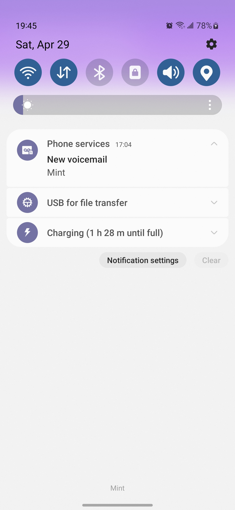
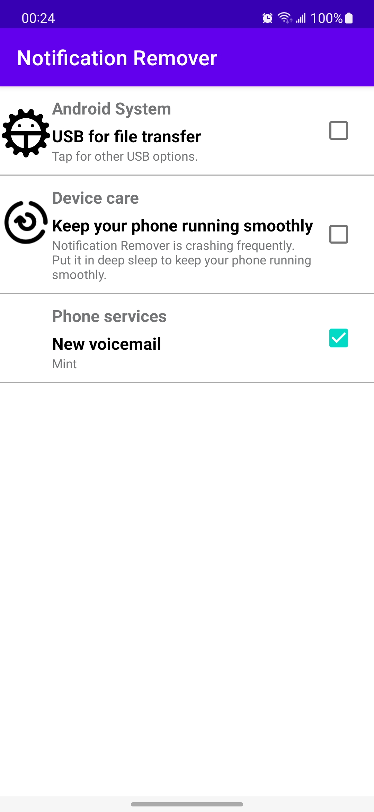
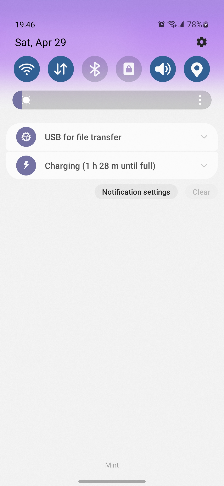

---

# Remove Any Ongoing (Fixed) Notifications on Android

1. Free and open-source (working on publishing to Google Play)
2. No ads
3. No background service, the notification listener service dies as soon as the app exits
4. Persistent effects even after reboot, unless the notification is
   cleared and then created again by its creator.
5. Easy to use, click to dismiss, click again to recover

# Motivation

For Android, on-going notifications are not clearable.
Examples are "USB for file transfer" and "New voicemail".

I was very pissed that the only way to clear the voicemail notification on my Samsung S22
was to:

1. Call my voicemail number
2. Input my voicemail password
3. Listen to the first few seconds
4. Delete the voicemail
5. Wait for a few seconds (otherwise it wouldn't work idk why)
6. End the call.
7. Finally the notification disappear

We used to be able to disable the notification of the phone call app and re-enable it to remove the
notification, according to some old videos on YouTube.
Now for some reason we cannot.

I am sick of product managers thinking they know better than users themselves.
Therefore, I made this app to remove any on-going notifications.

**We cannot remove the notification but we can snooze it for 100 years**,
and this is what this software does exactly.

# Existing Apps

There are two apps I know of that achieve similar things.

1. Notification Blocker & Cleaner (NCleaner)
    1. Too many ads
    2. In-app purchase
2. FilterBox
    1. Cannot recover dismissed on-going (fixed) notifications easily
    2. 30-day free trial
    3. Many useful features

# Demo

|  |  |  |
|---------------------------------------------|----------------------------------|--------------------------------------------------|
